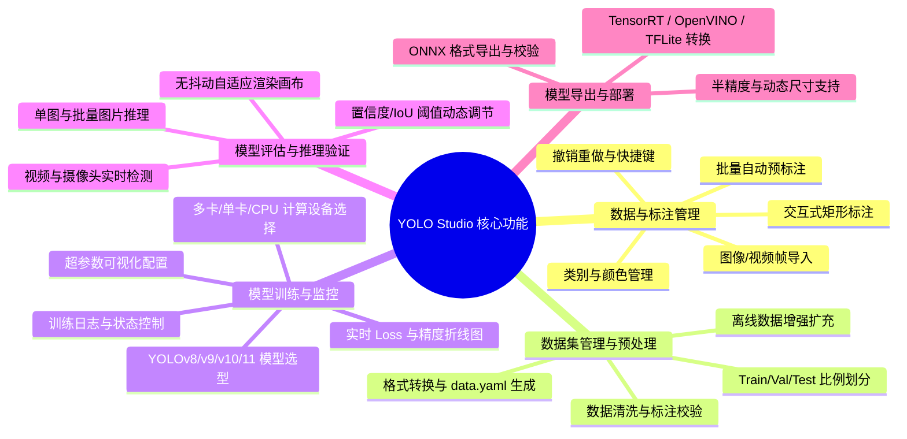

# YOLO Studio - 软件需求规格说明书 (SRS)

**文档版本**：v1.0.0  
**编制日期**：2026-08-20  
**项目名称**：YOLO Studio (图形化目标检测模型训练工作站)

---

## 1. 概述

### 1.1 编写目的
本文档明确了 **YOLO Studio** 的功能性需求与非功能性指标，为系统架构设计、编码实现、单元测试以及版本验收提供明确的规范依据。

### 1.2 目标用户群体
- **视觉算法工程师**：需要快速校验新数据集、清洗样本、微调超参数并导出多端部署模型的开发人员；
- **行业应用开发者**：需要通过直观界面快速构建特定场景目标检测模型的工程师；
- **高校师生与科研人员**：需要进行计算机视觉实验、教学演示和模型效果比对的人员。

---

## 2. 系统功能性需求

### 2.1 模块一：交互式图像标注 (FR-01)
- **FR-01-01 图像导入**：支持单张图像导入与目录批量加载，支持 `.jpg`, `.jpeg`, `.png`, `.bmp`, `.webp` 等常见格式。
- **FR-01-02 画布交互**：
  - 支持鼠标滚轮缩放，以鼠标当前指针位置为锚点平滑缩放；
  - 支持按住鼠标中键或空格键平移画布；
  - 提供十字交叉辅助线，辅助目标边缘对齐。
- **FR-01-03 目标框操作**：
  - 鼠标左键拖拽创建矩形标注框；
  - 支持选中已存在的标注框进行移动、拖动四角/边缘缩放；
  - 支持绑定与修改类别标签，并按类别自动着色。
- **FR-01-04 历史与快捷键**：
  - 支持 `Ctrl+Z`（撤销）与 `Ctrl+Y`（重做）；
  - 支持 `Delete` / `Backspace` 快速删除选中框；
  - 支持 `A` / `D` 或键盘左右方向键切换上一张/下一张图片，并在切换时自动保存标注文件。
- **FR-01-05 批量自动预打标**：
  - 支持选择预训练模型（如 `yolov8n.pt`）对未标注图片进行批量初筛打标。

### 2.2 模块二：数据集管理与预处理 (FR-02)
- **FR-02-01 数据集组织与配置**：
  - 自动将图像与标签组织为标准 YOLO 目录结构；
  - 自动生成格式合规的 `data.yaml` 配置文件。
- **FR-02-02 数据集划分**：
  - 提供滑块调整训练集、验证集与测试集比例（如 80% / 15% / 5%）；
  - 支持分层抽样，保持各子集类别比例均衡。
- **FR-02-03 数据质量体检**：
  - 自动检测空标注、坐标越界、负宽高无效框并提示修正。
- **FR-02-04 离线数据增强**：
  - 支持水平翻转、垂直翻转、旋转、色彩变化等增强方式，并在生成新图像时同步计算标签坐标。

### 2.3 模块三：模型训练与实时监控 (FR-03)
- **FR-03-01 模型与超参数配置**：
  - 支持 YOLOv8、YOLOv9、YOLOv10、YOLO11 系列检测模型；
  - 支持设置 Epochs、Batch Size、Image Size、优化器（SGD/AdamW）以及学习率；
  - 自动检测并允许选择 CUDA GPU 或 CPU 计算设备。
- **FR-03-02 训练控制与状态反馈**：
  - 提供开始训练、暂停、终止操作；
  - 训练任务在独立工作线程中运行，保持主界面流畅响应；
  - 实时动态绘制 Loss 损失曲线与 mAP 精度折线图，展示当前轮次进度与日志输出。

### 2.4 模块四：推理测试与验证 (FR-04)
- **FR-04-01 多源推理测试**：
  - 支持导入单张图片、批量图片或本地视频文件进行推理；
  - 支持直接开启本地摄像头进行实时画面检测。
- **FR-04-02 实时参数调节与画布稳定**：
  - 支持通过滑块实时调节置信度（Confidence）与 NMS IoU 阈值；
  - 采用自适应固定比例画布，视频播放时窗口大小保持稳定，不发生异常形变。

### 2.5 模块五：模型导出与多端适配 (FR-05)
- **FR-05-01 格式转换**：
  - 支持将 `.pt` 权重导出为 ONNX、TensorRT Engine、OpenVINO、CoreML、TFLite 等常用格式。
- **FR-05-02 导出参数设置**：
  - 支持配置输入分辨率、FP16 半精度加速与动态输入维度（Dynamic Axes）。

---

## 3. 非功能性需求

| 指标维度 | 具体要求 | 验收标准 |
| :--- | :--- | :--- |
| **界面响应** | 图像标注与画布拖拽流畅 | 缩放、平移与画框帧率稳定，无明显操作粘滞感 |
| **计算稳定性** | 训练任务与主界面解耦 | 训练过程中主界面各项功能可正常交互，不发生假死崩溃 |
| **离线可用性** | 纯本地环境运行支持 | 在完全无网络连接状态下，标注、切分、训练与推理均可正常执行 |
| **跨平台兼容** | 主流操作系统支持 | 支持 Windows 10/11、macOS 与 Linux (Ubuntu) |
| **代码可维护性** | 分层解耦设计 | 核心算法、数据逻辑与 UI 界面严格解耦，单测覆盖率良好 |
