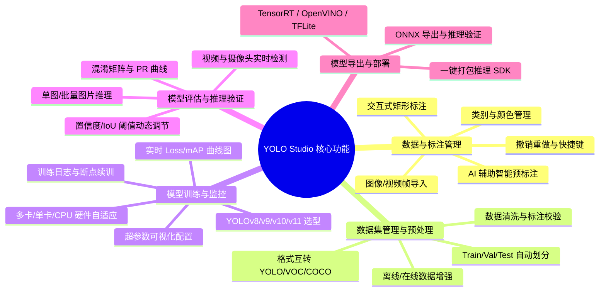

# YOLO Studio - 软件需求规格说明书 (SRS)

**文档版本**：v1.0.0  
**编制日期**：2026-08-20  
**项目名称**：YOLO Studio (YOLO 一站式图形化智能训练系统)

---

## 1. 引言

### 1.1 编写目的
本文档明确了 **YOLO Studio** 的功能性需求与非功能性需求，作为系统架构设计、详细编码实现、单元测试与系统验收的基准规范。

### 1.2 目标用户群体
- **AI 算法工程师**：需要快速验证新数据集、清洗数据、调整超参数并导出不同格式模型的专业人员；
- **业务开发工程师与自动化质检员**：需要零代码或低代码快速构建专属目标检测模型的行业用户；
- **高校师生与科研人员**：需要进行计算机视觉教学、实验演示和论文模型复现的人员。

---

## 2. 系统功能性需求 (Functional Requirements)

### 2.1 模块一：交互式图像标注模块 (FR-01)
- **FR-01-01 图像导入**：支持单图导入、文件夹批量导入，支持常见图像格式（`.jpg`, `.jpeg`, `.png`, `.bmp`, `.webp`）。
- **FR-01-02 交互画布**：
  - 支持鼠标滚轮平滑缩放（Zoom In / Out，支持以鼠标指针为中心缩放）。
  - 支持按住鼠标中键或空格键拖动画布（Pan）。
  - 支持十字交叉辅助线（Crosshair Cursor），便于精准对齐边界。
- **FR-01-03 目标标注**：
  - 鼠标左键拖拽创建矩形 Bounding Box。
  - 支持选中已创建的标注框进行移动、调整四角/四边大小（Resize）。
  - 支持为标注框绑定/修改类别（Class Name / Class ID）。
  - 自动为不同类别分配高对比度、美观的主题颜色。
- **FR-01-04 标注辅助与编辑历史**：
  - 完整支持 `Ctrl+Z`（撤销 Undo）与 `Ctrl+Y` / `Ctrl+Shift+Z`（重做 Redo）。
  - 支持快速删除选中框（`Delete` / `Backspace`）。
  - 支持前后图片快速切换（`A` / `D` 或方向键 `←` / `→`）。
  - 切换图片时自动保存当前图片的标注文件（`.txt`）。
- **FR-01-05 AI 辅助预标注 (Smart Auto-Labeling)**：
  - 支持选择预训练模型（如 `yolov8n.pt`, `yolov8x.pt`, `yolo11n.pt` 等）。
  - 支持一键对当前图片或全部未标注图片进行自动识别与目标框生成。

### 2.2 模块二：数据集管理与预处理模块 (FR-02)
- **FR-02-01 数据集结构管理**：
  - 自动组织为标准 YOLO 数据集结构：`images/train`, `images/val`, `images/test`, `labels/train`, `labels/val`, `labels/test`。
  - 自动生成符合 Ultralytics 规范的 `data.yaml` 配置文件。
- **FR-02-02 数据集划分**：
  - 提供滑动条或输入框自定义 Train / Val / Test 比例（例如默认 80% / 15% / 5% 或 70% / 20% / 10%）。
  - 支持随机分层抽样，确保各类别的样本在训练集和验证集中分布均衡。
- **FR-02-03 数据清洗与健康度检查**：
  - 自动检测并提示：无标注空图、坐标越界（超出 0~1 范围）、负宽高/零宽高无效框、未命名类别。
  - 支持一键自动修正或剔除异常数据。
- **FR-02-04 数据增强预览**：
  - 支持常见增强方式：水平翻转、垂直翻转、旋转、HSV 色调增强、高斯模糊、马赛克增强（Mosaic）等，并支持实时可视化预览。

### 2.3 模块三：模型训练与实时监控模块 (FR-03)
- **FR-03-01 模型与任务选择**：
  - 支持 YOLOv8（n/s/m/l/x）、YOLOv9（t/s/m/c/e）、YOLOv10（n/s/m/b/l/x）、YOLO11（n/s/m/l/x）。
  - 支持目标检测（Detect）、实例分割（Segment）等模式。
- **FR-03-02 超参数可视化配置**：
  - 基础参数：训练轮数（Epochs）、批次大小（Batch Size，支持 Auto Batch）、输入分辨率（Image Size，默认 640）、工作线程数（Workers）。
  - 优化器配置：Optimizer（SGD, Adam, AdamW, Auto）、学习率（lr0, lrf）、权重衰减（Weight Decay）、动量（Momentum）。
  - 硬件选择：自动检测本地 CUDA GPU（显卡型号、显存大小）、Apple Silicon MPS 或 CPU，并支持下拉选择。
- **FR-03-03 训练控制与状态机**：
  - 提供【开始训练】、【暂停训练】、【终止训练】、【恢复训练 (Resume)】操作按钮。
  - 训练任务在独立子进程/线程中运行，主界面保持 60FPS 响应，杜绝无响应或崩溃。
- **FR-03-04 实时动态指标大屏**：
  - 实时更新的动态折线图：`train/box_loss`, `train/cls_loss`, `train/dfl_loss`, `val/box_loss`, `metrics/precision(B)`, `metrics/recall(B)`, `metrics/mAP50(B)`, `metrics/mAP50-95(B)`。
  - 实时进度条：当前 Epoch 进度、总体 Epoch 进度、剩余预估时间（ETA）、显存占用率（VRAM %）。
  - 实时日志终端：格式化输出标准训练日志流。

### 2.4 模块四：模型评估与推理验证模块 (FR-04)
- **FR-04-01 验证指标可视化**：
  - 训练完成后自动加载并展示：混淆矩阵（Confusion Matrix）、F1-Confidence 曲线、Precision-Recall (PR) 曲线、Results 汇总图。
- **FR-04-02 交互式推理测试台 (Playground)**：
  - 支持单张图片拖拽推理、多张图片批量推理。
  - 支持视频文件推理与实时摄像头（Webcam）实时画面检测。
  - 提供可拖动的滑块实时动态调节【置信度阈值 (Confidence Score)】与【非极大值抑制 (NMS IoU)】。
  - 实时在图像上渲染检测框、类别标签、置信度分数及耗时（Pre-process, Inference, Post-process ms）。

### 2.5 模块五：模型导出与量化部署模块 (FR-05)
- **FR-05-01 多端格式一键导出**：
  - 支持导出为 **ONNX**（通用格式，支持动态输入/动态 Batch）、**TensorRT Engine**（GPU 极致加速）、**OpenVINO**（Intel CPU/GPU 加速）、**CoreML**（Apple 芯片加速）、**TFLite**（移动端/边缘端部署）、**TorchScript**。
- **FR-05-02 导出模型快速校验**：
  - 导出完成后，自动使用 ONNX Runtime 或对应后端载入导出模型进行前向推理校验，确保与原生 PyTorch 模型输出一致。

---

## 3. 非功能性需求 (Non-Functional Requirements)

### 3.1 性能与响应要求 (Performance)
- **画布操作延迟**：标注框缩放、移动、创建操作响应时间 $\le 16\text{ms}$（确保 60FPS 流畅度）。
- **超大图加载**：4K 分辨率（$3840 \times 2160$）图像首次渲染时间 $\le 200\text{ms}$。
- **训练指标刷新**：指标曲线刷新频率 $\approx 100\text{ms} \sim 500\text{ms}$，CPU 占用率增量 $< 3\%$。
- **推理耗时**：使用 GPU 进行单图 640x640 推理时，模型前向耗时 $\le 15\text{ms}$。

### 3.2 可靠性与稳定性 (Reliability & Robustness)
- **进程隔离保护**：训练异常（如 CUDA 显存不足 OOM）不得引起 GUI 主程序崩溃，主界面需捕获错误事件并弹出友好的恢复建议。
- **自动防丢失**：用户修改标注后，每 10 秒自动保存草稿快照，切换图片时强制执行落盘保存。
- **配置持久化**：所有超参数、最近打开的项目路径、窗口布局均自动保存在 `config.json` 中，再次启动时无缝恢复。

### 3.3 易用性与界面体验 (Usability & UI/UX)
- **现代美观设计**：采用深色（Dark Mode）与浅色（Light Mode）现代化 Fluent 设计风格，色彩搭配柔和，长时间标注不易视觉疲劳。
- **全流程向导**：提供引导式步骤导航（1.标注 $\rightarrow$ 2.数据 $\rightarrow$ 3.训练 $\rightarrow$ 4.测试 $\rightarrow$ 5.导出），新手小白 5 分钟即可上手。
- **快捷键覆盖**：核心操作（保存、上一张、下一张、删除、放大、缩小、适应窗口）均配备行业通用快捷键。

### 3.4 模块化与可维护性 (Maintainability & Extensibility)
- 遵循单一职责原则（SRP）与开闭原则（OCP），UI 逻辑与算法核心完全解耦。
- 提供标准化的 **Agents & Skills** 插件系统，允许开发者扩展自定义数据清洗器、自定义学习率调度策略或自定义硬件推理后端。
