# YOLO Studio - 系统架构与详细设计说明书

**文档版本**：v1.0.0  
**编制日期**：2026-08-20  
**项目名称**：YOLO Studio (YOLO 一站式图形化智能训练系统)

---

## 1. 系统总体架构设计

YOLO Studio 严格遵循 **分层架构（Layered Clean Architecture）** 与 **事件驱动设计（Event-Driven Architecture）** 原则，将表现层（UI）、业务逻辑层（Controller & ViewModel）、领域服务层（Core Engine & Services）以及持久层（Storage & I/O）彻底解耦。

```mermaid
graph TB
    subgraph Presentation_Layer ["1. 视图表现层 (Presentation / UI Layer)"]
        MainWindow["主窗口 (MainWindow)"]
        AnnotationTab["交互式标注工作台 (AnnotationView)"]
        DatasetTab["数据集与数据增强工作台 (DatasetView)"]
        TrainTab["训练控制与实时大屏 (TrainView)"]
        InferenceTab["推理与交互测试台 (InferenceView)"]
        ExportTab["模型导出与部署工作台 (ExportView)"]
        Widgets["复用组件库 (Canvas2D / MetricPlots / LogConsole / StatusBadge)"]
    end

    subgraph Controller_Layer ["2. 控制与视图模型层 (Controller & ViewModel Layer)"]
        AppController["主程序中枢调度器 (AppController)"]
        AnnotationCtrl["标注交互控制器 (AnnotationController)"]
        DatasetCtrl["数据集流转控制器 (DatasetController)"]
        TrainCtrl["训练生命周期控制器 (TrainController)"]
        InferenceCtrl["推理会话控制器 (InferenceController)"]
        AgentManager["智能体调度中枢 (Agent & Skill Manager)"]
    end

    subgraph Domain_Service_Layer ["3. 核心领域与服务引擎层 (Domain & Service Engines)"]
        TrainerEngine["YOLO 训练引擎 (TrainerEngine - Ultralytics Wrapper)"]
        InferenceEngine["高精快速推理引擎 (InferenceEngine - PyTorch/ONNX)"]
        AutoLabelEngine["AI 辅助预标注引擎 (AutoLabelEngine)"]
        AugmentationService["图像与标注同步增强服务 (AugmentationService)"]
        ExportEngine["模型多格式转换引擎 (ModelExportEngine)"]
        DatasetAuditor["数据集质量与健康审计器 (DatasetAuditor)"]
    end

    subgraph Process_Communication ["4. 进程隔离与通信层 (Process Isolation & IPC)"]
        SubprocessWorker["独立的训练子进程 (QProcess / Multiprocessing)"]
        EventBus["异步事件总线 (Qt Signals / Thread-safe Event Queue)"]
        LogPipe["标准输出/错误流重定向管道 (StdIO Redirector)"]
    end

    subgraph Storage_Layer ["5. 数据与存储持久层 (Storage & Persistence Layer)"]
        ConfigManager["全局配置文件 (config.json / settings.yaml)"]
        YoloDatasetIO["YOLO / VOC / COCO 格式解析与写入器"]
        CheckpointIO["模型权重与训练快照管理器 (.pt / .onnx / .engine)"]
    end

    Presentation_Layer --> Controller_Layer
    Controller_Layer --> Domain_Service_Layer
    Controller_Layer <--> Process_Communication
    Domain_Service_Layer --> Storage_Layer
    Process_Communication --> Domain_Service_Layer
```



---

## 2. 核心模块详细设计

### 2.1 画布交互与标注引擎 (Annotation Engine & Canvas)
- **核心组件**：
  - `AnnotationCanvas (QGraphicsView)`：视口控制、鼠标事件捕获（滚轮缩放、中键拖拽、左键框选）、十字对齐辅助线绘制。
  - `AnnotationScene (QGraphicsScene)`：图元管理空间。
  - `BoundingBoxItem (QGraphicsRectItem)`：可交互图元，重写 `hoverEnterEvent`, `mousePressEvent`, `mouseMoveEvent`，支持 8 个方向控制手柄（Handle）的拖拽缩放与中心移动。
  - `UndoCommandStack (QUndoStack)`：利用命令模式封装 `CreateBoxCommand`, `DeleteBoxCommand`, `MoveBoxCommand`, `ResizeBoxCommand`, `ChangeClassCommand`，提供完整的 `Ctrl+Z` / `Ctrl+Y` 历史回退能力。

### 2.2 数据集管理与流水线 (Dataset Pipeline)
- **核心组件**：
  - `DatasetManager`：管理图片索引列表、类别字典（`class_names: list[str]`）、颜色映射表（`class_colors: dict[int, str]`）。
  - `DatasetSplitter`：执行分层随机抽样，将未划分的数据按指定比例（如 8:1:1）切分并生成 `images/train`, `images/val`, `images/test` 与 `labels/train`, `labels/val`, `labels/test`。
  - `YAMLGenerator`：自动输出 Ultralytics 兼容的 `data.yaml`。
  - `AugmentationPipeline`：集成 Albumentations 与 OpenCV，在进行几何变换（翻转、旋转、缩放）时自动同步调整 Bounding Box 的归一化坐标 $(x_{center}, y_{center}, w, h)$。

### 2.3 训练引擎与异步非阻塞架构 (Trainer Engine & Concurrency)
- **痛点与解决方案**：
  - 深度学习训练是耗时且极耗算力的操作，若在 GUI 主线程运行会导致界面无响应（Window Not Responding）。
  - **设计方案**：
    1. 训练任务封装在 `TrainWorker(QThread)` 或独立 `multiprocessing.Process` 中。
    2. 挂接 Ultralytics 的 Hook 回调机制：
       - `on_train_epoch_start`: 发送 Epoch 开始信号；
       - `on_train_batch_end`: 发送 Batch 训练损失（Box Loss, Cls Loss, DFL Loss）及当前 Epoch 进度；
       - `on_fit_epoch_end`: 提取验证集指标（mAP50, mAP50-95, Precision, Recall）并向主线程发送结构化字典；
       - `on_train_end`: 发送训练完成信号，返回最优权重路径 `best.pt`。
    3. UI 主线程接收到信号后，在 `RealtimePlotWidget`（基于 Matplotlib / PySide6 自绘或 PyQtGraph）中实现 60FPS 极速增量重绘，完全不占用主线程计算时间。

### 2.4 推理与评估引擎 (Inference & Evaluation Engine)
- **核心组件**：
  - `InferenceSession`：封装 PyTorch `.pt` 与 ONNX `.onnx` 的统一推理接口。
  - `InferenceWorker`：支持批量异步推理、视频逐帧解码推理与网络摄像头（Webcam）取流。
  - `MetricsVisualizer`：自动扫描训练输出目录 `runs/detect/train/`，动态展示 `results.png`, `confusion_matrix.png`, `F1_curve.png`, `PR_curve.png` 等评估大图。

### 2.5 格式导出与量化引擎 (Model Exporter)
- **核心组件**：
  - `ModelExporter`：调用 `model.export(format='onnx', dynamic=True, simplify=True, half=False)`。
  - 支持多格式适配：ONNX, TensorRT, OpenVINO, CoreML, TFLite, TorchScript。
  - 导出后自动执行 `ONNXRuntimeValidator`，加载示例图片进行前向推理并比对输出张量一致性。

---

## 3. 设计模式与工程实践 (Design Patterns)

1. **命令模式 (Command Pattern)**：用于标注画布的 Undo/Redo 历史记录，确保所有操作可溯源、可回滚。
2. **观察者模式 / 发布-订阅 (Observer / Signals & Slots)**：用于各模块间解耦通信（如数据集变更通知训练界面更新类别数、训练进度通知图表重绘）。
3. **工厂模式 (Factory Pattern)**：用于多格式导出器（`ExporterFactory`）与不同模型架构（`ModelFactory`）的实例化。
4. **单例模式 (Singleton Pattern)**：用于全局配置管理器（`ConfigManager`）与日志服务（`Logger`）。

---

## 4. 目录结构设计 (Project Layout)

```
yolo_studio/
├── Doc/                                # 10 大标准软件工程与用户文档
│   ├── 01_FEASIBILITY_REPORT.md
│   ├── 02_REQUIREMENTS_SPECIFICATION.md
│   ├── 03_SYSTEM_ARCHITECTURE.md
│   ├── 04_DATASET_SPECIFICATION.md
│   ├── 05_AGENTS_AND_SKILLS_SPECIFICATION.md
│   ├── 06_USER_MANUAL.md
│   ├── 07_DEVELOPER_GUIDE.md
│   ├── 08_API_REFERENCE.md
│   ├── 09_TEST_AND_DEPLOYMENT_PLAN.md
│   └── 10_GITHUB_BACKUP_GUIDE.md
├── agents/                             # Agents & Skills 智能体系统
│   ├── __init__.py
│   ├── base_agent.py                   # 智能体基类
│   ├── dataset_audit_agent.py          # 数据集健康度诊断智能体
│   ├── autotrain_agent.py              # 训练策略与超参推荐智能体
│   └── skills/                         # 技能实现
│       ├── __init__.py
│       ├── auto_label_skill.py         # AI 智能辅助标注技能
│       ├── augmentation_skill.py       # 智能数据增强技能
│       └── export_skill.py             # 多格式转换与量化技能
├── src/                                # 应用程序源码
│   ├── __init__.py
│   ├── app.py                          # 应用程序入口
│   ├── core/                           # 核心业务与领域模型
│   │   ├── __init__.py
│   │   ├── annotation.py               # 标注数据模型与撤销重做命令
│   │   ├── dataset_manager.py          # 数据集管理、格式转换、划分
│   │   ├── trainer.py                  # YOLO 训练引擎包装与进程隔离
│   │   ├── inference.py                # 快速推理与多源输入处理
│   │   ├── autolabel.py                # 预标注模型服务
│   │   └── exporter.py                 # 模型导出服务
│   ├── ui/                             # 图形界面 (PySide6)
│   │   ├── __init__.py
│   │   ├── main_window.py              # 主工作台窗口
│   │   ├── canvas.py                   # 高性能交互标注画布
│   │   ├── views/                      # 5 大功能子视图
│   │   │   ├── __init__.py
│   │   │   ├── annotation_view.py      # 标注视图
│   │   │   ├── dataset_view.py         # 数据集与增强视图
│   │   │   ├── train_view.py           # 训练配置与监控大屏
│   │   │   ├── inference_view.py       # 推理与测试视图
│   │   │   └── export_view.py          # 模型导出视图
│   │   ├── widgets/                    # 通用自定义控件
│   │   │   ├── __init__.py
│   │   │   ├── metric_plots.py         # 实时指标图表控件
│   │   │   ├── log_console.py          # 训练日志终端控件
│   │   │   └── class_list_widget.py    # 类别管理列表控件
│   │   └── styles/                     # 现代化主题样式
│   │       ├── dark_theme.qss          # 优雅暗黑主题
│   │       └── light_theme.qss         # 清爽明亮主题
│   └── utils/                          # 基础工具库
│       ├── __init__.py
│       ├── config.py                   # 配置管理与持久化
│       ├── logger.py                   # 结构化日志组件
│       └── hardware.py                 # GPU/CUDA/MPS/CPU 硬件检测
├── tests/                              # 测试套件
│   ├── __init__.py
│   ├── test_dataset_manager.py
│   ├── test_annotation_model.py
│   └── test_exporter.py
├── requirements.txt                    # 核心依赖清单
├── .gitignore                          # Git 忽略配置
└── README.md                           # 项目快速指南与说明
```
