# YOLO Studio - 系统架构与详细设计说明书

**文档版本**：v1.0.0  
**编制日期**：2026-08-20  
**项目名称**：YOLO Studio (图形化目标检测模型训练工作站)

---

## 1. 系统总体架构设计

YOLO Studio 遵循 **分层架构（Layered Architecture）** 与 **事件驱动设计（Event-Driven Design）** 原则，将表现层（UI）、控制与视图模型层（Controller & ViewModel）、核心领域与服务引擎层（Core Engine）以及持久化存储层（Storage & I/O）清晰解耦。

```mermaid
graph TB
    subgraph Presentation_Layer ["1. 视图表现层 (Presentation / UI Layer)"]
        MainWindow["主窗口 (MainWindow)"]
        AnnotationTab["交互式标注工作台 (AnnotationView)"]
        DatasetTab["数据集与数据增强工作台 (DatasetView)"]
        TrainTab["训练控制与实时大屏 (TrainView)"]
        InferenceTab["推理与交互测试台 (InferenceView)"]
        ExportTab["模型导出与部署工作台 (ExportView)"]
        Widgets["复用组件库 (Canvas2D / VideoCanvas / MetricPlots / LogConsole)"]
    end

    subgraph Controller_Layer ["2. 控制与视图模型层 (Controller & ViewModel Layer)"]
        AppController["主程序中枢调度器 (AppController)"]
        AnnotationCtrl["标注交互控制器 (AnnotationController)"]
        DatasetCtrl["数据集流转控制器 (DatasetController)"]
        TrainCtrl["训练生命周期控制器 (TrainController)"]
        InferenceCtrl["推理会话控制器 (InferenceController)"]
        AutomationModules["自动化与辅助工具管理器 (Automation Manager)"]
    end

    subgraph Domain_Service_Layer ["3. 核心领域与服务引擎层 (Domain & Service Engines)"]
        TrainerEngine["YOLO 训练引擎 (YoloTrainerWorker)"]
        InferenceEngine["统一推理引擎 (InferenceEngine - PyTorch/ONNX)"]
        AutoLabelEngine["批量预标注引擎 (AutoLabelEngine)"]
        AugmentationService["图像与标注同步增强服务 (AugmentationService)"]
        ExportEngine["模型多格式转换引擎 (ModelExporter)"]
        DatasetAuditor["数据集质量体检器 (DatasetAuditor)"]
    end

    subgraph Process_Communication ["4. 线程隔离与通信层 (Concurrency & IPC)"]
        TrainerThread["独立训练工作子线程 (QThread)"]
        EventBus["异步信号流 (Qt Signals / Slots)"]
        LogPipe["标准输出/日志管道 (SafeStreamHandler)"]
    end

    subgraph Storage_Layer ["5. 数据与存储持久层 (Storage & Persistence Layer)"]
        ConfigManager["全局配置文件 (config.json / settings.yaml)"]
        YoloDatasetIO["YOLO 格式解析与写入器"]
        CheckpointIO["模型权重与训练快照管理器 (.pt / .onnx)"]
    end

    Presentation_Layer --> Controller_Layer
    Controller_Layer --> Domain_Service_Layer
    Controller_Layer <--> Process_Communication
    Domain_Service_Layer --> Storage_Layer
    Process_Communication --> Domain_Service_Layer
```



---

## 2. 核心模块详细设计

### 2.1 画布交互与标注引擎 (Annotation Engine & Canvas)
- **核心组件**：
  - `AnnotationCanvas (QGraphicsView)`：视口控制、鼠标事件捕获（滚轮缩放、中键拖拽、左键框选）、十字对齐辅助线绘制。
  - `AnnotationScene (QGraphicsScene)`：图元管理空间。
  - `BoxItem (QGraphicsRectItem)`：可交互图元，支持 8 个方向控制手柄的拖拽缩放与中心平移。
  - `QUndoStack`：利用命令模式封装 `CreateBoxCommand`, `DeleteBoxCommand`, `MoveBoxCommand`, `ResizeBoxCommand`, `ChangeClassCommand`，提供完整的 `Ctrl+Z` / `Ctrl+Y` 历史回退能力。

### 2.2 数据集管理与流水线 (Dataset Pipeline)
- **核心组件**：
  - `DatasetManager`：管理图片索引列表、类别字典（`class_names: list[str]`）、颜色映射表（`class_colors: dict[int, str]`）。
  - `DatasetSplitter`：执行分层随机抽样，将数据按指定比例（如 80% / 15% / 5%）切分并生成 `images/train`, `images/val`, `images/test` 与 `labels/train`, `labels/val`, `labels/test`。
  - `YAMLGenerator`：自动输出 Ultralytics 兼容的 `data.yaml`。
  - `AugmentationPipeline`：在进行几何变换（翻转、旋转、缩放）时自动同步调整 Bounding Box 的归一化坐标 $(x_{center}, y_{center}, w, h)$。

### 2.3 训练引擎与异步非阻塞架构 (Trainer Engine & Concurrency)
- **设计方案**：
  1. 训练任务封装在 `YoloTrainerWorker(QThread)` 独立工作线程中，主界面保持流畅交互。
  2. 挂接 Ultralytics 的 Hook 回调机制：
     - `on_train_batch_end`: 发送当前 Batch 训练损失及轮次进度；
     - `on_train_epoch_end`: 提取验证集指标（mAP50, mAP50-95, Precision, Recall）并向主线程发送结构化字典；
     - `on_train_end`: 发送训练完成信号，返回最优权重路径 `best.pt`。
  3. UI 主线程接收到信号后，在 `MetricPlotsWidget`（基于 Matplotlib / PySide6）中增量刷新曲线，保证图表更新与主界面渲染的平滑。

### 2.4 推理与效果验证引擎 (Inference Engine)
- **核心组件**：
  - `InferenceEngine`：封装 PyTorch `.pt` 与 ONNX `.onnx` 的统一推理接口。
  - `ImageDisplayCanvas`：采用独立渲染视口绘制图像与视频流，设置尺寸策略为 `Ignored`，彻底切断布局撑大递归反馈环，确保窗口大小绝对稳定。
  - 支持单张图片推理、本地视频逐帧推理以及摄像头实时检测。

### 2.5 格式导出引擎 (Model Exporter)
- **核心组件**：
  - `ModelExporter`：调用底层导出接口生成 ONNX、TensorRT Engine、OpenVINO、CoreML、TFLite 等格式。
  - `ONNXValidator`：在导出完成后自动尝试载入 ONNX 模型并进行前向形状验证，确保导出权重的可用性。

---

## 3. 源码工程目录结构

```text
Yolo_Model_Training/
├── Doc/                                # 完整工程技术与用户文档
├── agents/                             # 自动化辅助模块
│   ├── base_agent.py                   # 模块基类与生命周期接口
│   ├── dataset_audit_agent.py          # 数据集健康度诊断模块
│   ├── autotrain_agent.py              # 训练策略与超参推荐模块
│   ├── app_test_agent.py               # 自动化测试与巡检模块
│   ├── bug_fix_agent.py                # 缺陷分析与自愈模块
│   └── skills/                         # 独立工具函数库
│       ├── auto_label_skill.py         # 自动预标注工具
│       ├── augmentation_skill.py       # 数据增强工具
│       ├── export_skill.py             # 模型导出工具
│       ├── gui_test_skill.py           # GUI 自动化测试工具
│       └── bug_analyzer_skill.py       # 缺陷模式分析工具
├── samples/                            # 演示样本图像与示例微缩数据集
├── src/                                # 应用程序核心源码
│   ├── app.py                          # 程序启动入口
│   ├── core/                           # 核心领域与算法引擎
│   │   ├── annotation.py               # 边界框几何数据模型
│   │   ├── dataset_manager.py          # 数据集管理与划分
│   │   ├── trainer.py                  # 训练工作线程与指标监听
│   │   ├── inference.py                # 统一推理引擎
│   │   ├── autolabel.py                # 批量预标注实现
│   │   └── exporter.py                 # 模型导出与校验
│   ├── ui/                             # 基于 PySide6 的图形界面
│   │   ├── main_window.py              # 主工作台窗口
│   │   ├── canvas.py                   # 高性能标注画布
│   │   ├── views/                      # 5 大功能子视图
│   │   ├── widgets/                    # 动态折线图、防抖画布、终端控制台
│   │   └── styles/                     # 深色与浅色 QSS 样式表
│   └── utils/                          # 配置管理、日志工具、硬件检测
└── tests/                              # 自动化单元测试与集成测试套件
```
