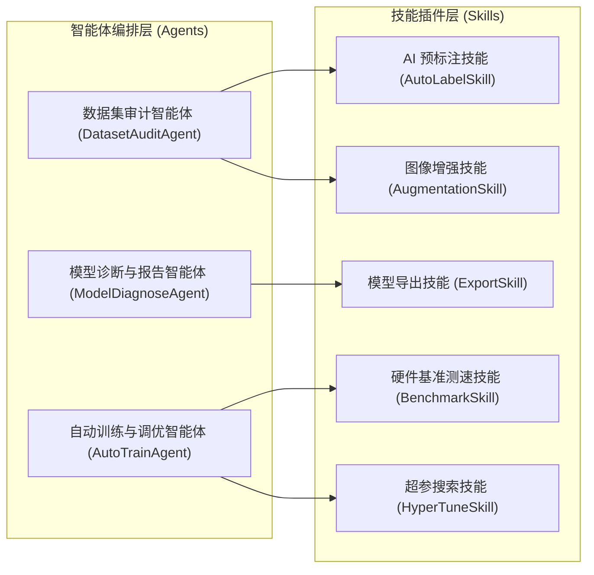

# YOLO Studio - 智能体 (Agents) 与技能 (Skills) 扩展系统规范

**文档版本**：v1.0.0  
**编制日期**：2026-08-20  
**项目名称**：YOLO Studio

---

## 1. 架构定位与设计哲学

为了让 YOLO Studio 具备极高的扩展性、易维护性与自进化能力，系统引入了 **Agents & Skills 插件化智能体架构**。

- **智能体 (Agent)**：具备自主决策、多步编排与状态上下文感知的核心实体（例如负责数据集审查的 `DatasetAuditAgent`、负责全自动调参与训练策略调度的 `AutoTrainAgent`）；
- **技能 (Skill)**：单一职责、高度复用、输入输出明确的原子化功能单元（例如 `AutoLabelSkill` 智能辅助标注、`AugmentationSkill` 智能数据增强、`ExportSkill` 多端格式转换与量化）。



---

## 2. 核心智能体规范 (Agents Specification)

### 2.1 数据集审计智能体 (`DatasetAuditAgent`)
- **职责**：全面扫描用户导入的图片与标注文件，识别异常并生成健康度评分（0-100分）。
- **执行流程**：
  1. 调用 `DatasetAuditor` 扫描空标注、坐标越界、长宽比异常与未闭合框；
  2. 统计各类别目标分布柱状图，计算基尼系数或熵值评估数据分布均匀度；
  3. 若发现数据量不足（每类少于 100 张图），主动调用 `AugmentationSkill` 建议增强方案；
  4. 若存在大量未标注图片，主动建议调用 `AutoLabelSkill` 执行批量预标注。

### 2.2 自动训练与超参优化智能体 (`AutoTrainAgent`)
- **职责**：根据数据集规模、目标尺寸分布以及用户硬件环境，自动决策最优训练方案。
- **决策规则**：
  - **显存与硬件适配**：检测 GPU VRAM 大小。若 VRAM $\le 4\text{GB}$，自动推荐 `yolov8n` / `yolo11n`，设置 `batch=8`, `imgsz=640`，开启 `amp=True`（半精度）；若 VRAM $\ge 16\text{GB}$，推荐 `yolov8x` 或更大模型并启用更高 batch 大小。
  - **收敛策略**：根据小目标与密集目标占比，动态调整 `box` 损失权重与 `mosaic` 增强概率。

### 2.3 模型诊断与报告智能体 (`ModelDiagnoseAgent`)
- **职责**：在训练完成后解析 `runs/detect/train/` 下的指标曲线与混淆矩阵，生成通俗易懂的质量诊断与改进建议报告。
- **输出示例**：
  - “类别 `helmet` 的召回率（Recall 96%）优异，但类别 `vest` 的精确率（Precision 62%）较低，存在较多误检，建议增加反光背心在反光强光场景下的负样本图片。”

---

## 3. 核心技能规范 (Skills Specification)

### 3.1 AI 辅助预标注技能 (`AutoLabelSkill`)
- **接口定义**：
  ```python
  class AutoLabelSkill:
      def run(self, image_paths: list[str], model_name: str = "yolov8n.pt", 
              conf_threshold: float = 0.25, iou_threshold: float = 0.45,
              target_classes: list[int] = None) -> dict[str, list[dict]]:
          """
          执行智能预打标，返回每张图片的预测检测框列表
          """
          ...
  ```
- **工作机制**：在后台线程加载轻量预训练模型，多线程批处理预测目标框并格式化为 YOLO TXT 格式，实时回显至前端标注画布。

### 3.2 图像增强技能 (`AugmentationSkill`)
- **接口定义**：
  ```python
  class AugmentationSkill:
      def generate_augmented_dataset(self, source_dir: str, target_dir: str, 
                                     augment_factor: int = 2,
                                     transforms: list[str] = ["flip", "hsv", "rotate"]) -> bool:
          """
          对训练集进行离线增强扩充，保持坐标同步转换
          """
          ...
  ```

### 3.3 模型多端导出技能 (`ExportSkill`)
- **接口定义**：
  ```python
  class ExportSkill:
      def export_model(self, weights_path: str, format: str = "onnx", 
                       imgsz: int = 640, half: bool = False, 
                       dynamic: bool = True) -> str:
          """
          导出并自动校验 ONNX / TensorRT / OpenVINO 模型
          """
          ...
  ```

---

## 4. 自定义技能开发与接入指南

开发者只需继承 `BaseSkill` 或 `BaseAgent` 并在 `agents/skills/` 目录下添加 Python 脚本，系统即可通过反射机制自动注册并挂载到主界面的智能助理面板中。
