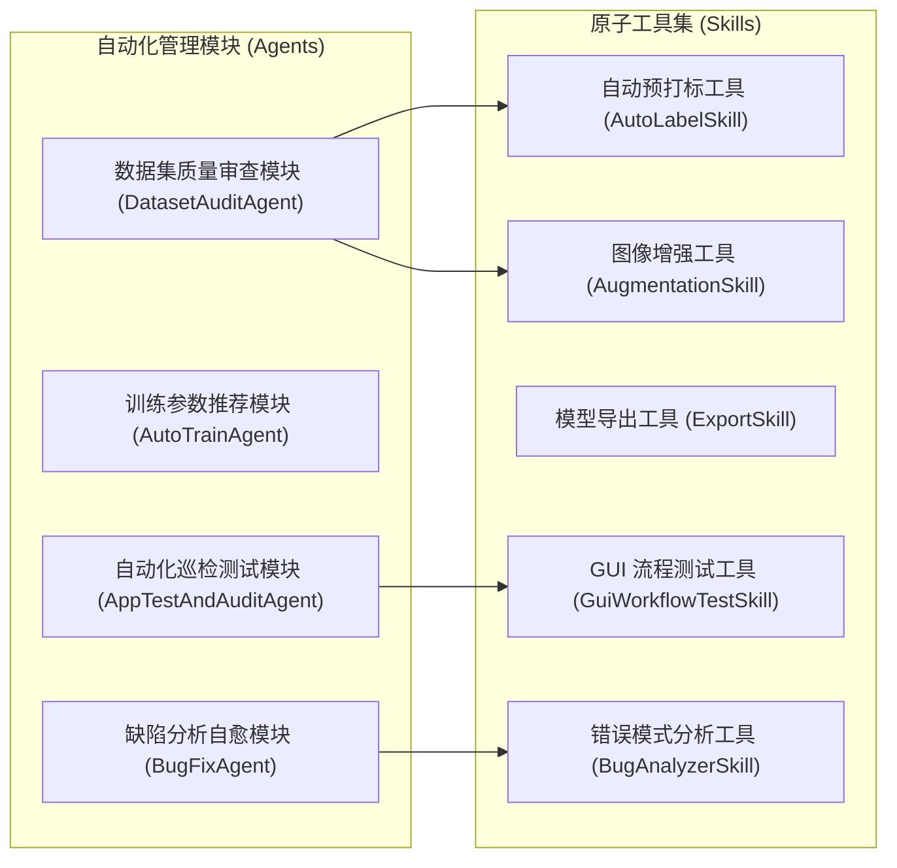

# YOLO Studio - 自动化与辅助模块设计规范

**文档版本**：v1.0.0  
**编制日期**：2026-08-20  
**项目名称**：YOLO Studio

---

## 1. 架构定位与设计哲学

为了让 YOLO Studio 具备良好的模块扩展性与可维护性，系统在核心训练管线之外，抽象出了一套**自动化与辅助工具模块体系（Automation & Skills Framework）**。

- **工作流管理模块 (Agent/Coordinator)**：负责多步骤流程的编排与状态上下文管理（例如负责数据集质量审查的 `DatasetAuditAgent`、负责自动化调参建议的 `AutoTrainAgent`、负责系统自测的 `AppTestAndAuditAgent` 以及负责缺陷分析的 `BugFixAgent`）；
- **工具函数与技能 (Skill/Utility)**：封装单一职责、高内聚的独立处理功能（例如批量自动预打标 `AutoLabelSkill`、离线数据增强 `AugmentationSkill`、模型多格式转换 `ExportSkill`、自动化测试 `GuiWorkflowTestSkill`）。



---

## 2. 核心管理模块说明

### 2.1 数据集质量审查模块 (`DatasetAuditAgent`)
- **职责**：遍历并扫描导入的图片与标注文件，识别潜在数据缺陷并输出健康度评分（0-100分）。
- **执行流程**：
  1. 扫描是否存在空标注、坐标越界、长宽比异常与未闭合框；
  2. 统计各类别目标分布柱状图，评估数据类别均衡度；
  3. 若发现数据量不足（每类少于 50 张图），提示建议使用数据增强进行扩充；
  4. 若存在未标注图片，提示可使用自动预标注工具批量初筛打标。

### 2.2 自动训练参数推荐模块 (`AutoTrainAgent`)
- **职责**：根据数据集规模、图片分辨率以及用户本地硬件设备配置，给出合理的初始训练超参数建议。
- **推荐策略**：
  - **显存与硬件适配**：检测 GPU 显存。若显存 $\le 4\text{GB}$ 或使用 CPU 训练，推荐 `yolov8n` / `yolo11n`，设置 `batch=8`, `imgsz=640` 并开启半精度（AMP）；若显存 $\ge 16\text{GB}$，可选用更大规模模型并增加 batch 大小。
  - **轮数与分辨率**：根据小目标与数据总量给出推荐的训练轮数。

### 2.3 应用自动化巡检与质量测试模块 (`AppTestAndAuditAgent`)
- **职责**：对标注、数据集切分、训练引擎、推理测试与模型导出等核心工作流执行自动化测试与质量巡检，生成结构化诊断报告。
- **输出**：包含测试通过率、异常堆栈与复现信息的诊断报告。

### 2.4 缺陷分析与自愈辅助模块 (`BugFixAgent`)
- **职责**：解析运行日志与报错信息，匹配常见的已知错误模式（例如数据字典键值不匹配、显存不足、窗口尺寸递归放大等），给出针对性的修复建议。

---

## 3. 常用工具函数规范

### 3.1 批量自动预打标 (`AutoLabelSkill`)
- **接口定义**：
  ```python
  class AutoLabelSkill:
      def run(self, image_paths: list[str], model_name: str = "yolov8n.pt", 
              conf_threshold: float = 0.25, iou_threshold: float = 0.45,
              target_classes: list[int] = None) -> dict[str, list[dict]]:
          """
          执行批量预打标，返回每张图片的预测检测框列表
          """
          ...
  ```
- **工作机制**：在后台线程加载轻量模型，批处理预测目标框并格式化为 YOLO TXT 格式，回显至前端标注画布。

### 3.2 离线数据增强 (`AugmentationSkill`)
- **接口定义**：
  ```python
  class AugmentationSkill:
      def generate_augmented_dataset(self, source_dir: str, target_dir: str, 
                                     augment_factor: int = 2,
                                     transforms: list[str] = ["flip", "hsv", "rotate"]) -> bool:
          """
          对训练集进行离线数据扩充，保持坐标同步转换
          """
          ...
  ```

### 3.3 模型多端导出 (`ExportSkill`)
- **接口定义**：
  ```python
  class ExportSkill:
      def export_model(self, weights_path: str, format: str = "onnx", 
                       imgsz: int = 640, half: bool = False, 
                       dynamic: bool = True) -> str:
          """
          导出并自动校验 ONNX / TensorRT / OpenVINO 模型
          """
          ...
  ```

---

## 4. 自定义工具扩展指南

开发者只需继承 `BaseSkill` 或 `BaseAgent` 并在 `agents/skills/` 目录下添加对应的 Python 脚本，即可快速扩展新的数据处理能力或测试逻辑。
