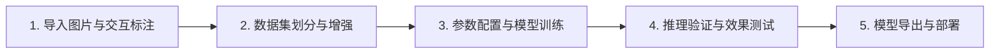

# YOLO Studio - 用户使用与操作指南 (User Manual)

**文档版本**：v1.0.0  
**适用对象**：视觉应用开发者、算法工程师、质检技术员、学生与科研人员

---

## 1. 软件概述与快速上手流程

YOLO Studio 提供了从数据标注到模型导出的全流程图形化操作支持，通常只需以下 5 个步骤即可完成模型训练与效果验证：

---

## 2. 详细操作步骤

### 第一步：导入图像与交互式标注 (Annotation Tab)

1. **打开项目目录**：
   - 点击顶部菜单栏【文件】 $\rightarrow$ 【打开项目/图片目录】，选择存放待标注图片的文件夹。
   - 左侧列表将显示该文件夹下的所有图片及标注状态（绿色表示已有标注，灰色表示未标注）。

2. **添加自定义识别类别**：
   - 在右侧【类别列表】中，点击【+ 添加类别】输入类别名称（如 `dog`, `cat`, `person`）。
   - 软件会自动为不同类别分配区分度良好的颜色，也可以双击色块自定义修改。

3. **画框标注目标对象**：
   - 在画布中，按住鼠标左键并拖拽即可框选目标对象；
   - 松开鼠标后，在弹出的列表中选择对应的类别名称（或按键盘数字键快速选择）；
   - **调整与移动**：点击已有标注框，拖动四周手柄可调整大小，拖动框体中心可移动位置；
   - **删除标注框**：选中标注框后按下键盘 `Delete` 键或 `Backspace` 键即可删除。

4. **批量自动预标注**：
   - 当待标注图像数量较多时，可点击工具栏上的【批量自动预标注】按钮；
   - 选择预训练模型（如 `yolov8n.pt`）与置信度阈值，执行自动打标；
   - 软件将批量生成候选框，随后只需人工检查并微调少数偏差框即可。

5. **常用快捷键**：
   | 快捷键 | 功能说明 |
   | :--- | :--- |
   | `A` 或 `←` | 切换到上一张图片（自动保存当前标注） |
   | `D` 或 `→` | 切换到下一张图片（自动保存当前标注） |
   | `Ctrl + S` | 立即保存当前标注 |
   | `Ctrl + Z` | 撤销上一步操作（Undo） |
   | `Ctrl + Y` | 重做上一步操作（Redo） |
   | `Delete` | 删除当前选中的标注框 |
   | `滚轮滑动` | 以鼠标指针为中心缩放图像 |
   | `按住中键/空格` | 拖动画布平移视野 |

---

### 第二步：数据集管理与清洗 (Dataset Tab)

1. **数据集自动划分**：
   - 切换到【数据集管理】页面，查看当前图片总数与各类别分布统计。
   - 调整切分比例（推荐默认：**训练集 80% / 验证集 15% / 测试集 5%**），点击【划分数据集】按钮，系统将自动生成标准 YOLO 目录结构与 `data.yaml` 文件。

2. **数据质量体检**：
   - 点击【深度体检】，系统自动排查是否存在无标注空图、越界坐标或损坏图像。

3. **数据增强扩充 (可选)**：
   - 如果样本数量较少，可勾选【水平翻转】、【色彩抖动】、【小角度旋转】等增强算子，点击【生成增强样本】进行数据扩充。

---

### 第三步：参数配置与模型训练 (Training Tab)

1. **选择模型结构**：
   - 切换到【模型训练】页面；
   - 在【预训练模型】下拉框中选择适合当前场景的版本：
     - **YOLOv8n / YOLO11n (Nano)**：轻量快速，适合低算力设备或实时性要求高的场景；
     - **YOLOv8s / YOLO11s (Small)**：平衡型，兼顾精度与速度；
     - **YOLOv8m / YOLOv8x (Medium/XLarge)**：大模型，适合追求更高检测精度的场景。

2. **配置训练参数**：
   - **训练轮数 (Epochs)**：根据数据集规模设置，一般建议 `50` ~ `100` 轮；
   - **批次大小 (Batch Size)**：常规建议 `8` 或 `16`；
   - **图像尺寸 (Image Size)**：默认 `640`（小图或轻量设备可设为 `320`）；
   - **计算设备 (Device)**：自动识别本地 NVIDIA 独立显卡（如 `CUDA:0`），若无独显则自动使用 `CPU`。

3. **启动训练与实时监控**：
   - 点击【开始训练】；
   - 训练期间，界面中央大屏将**实时动态绘制**：
     - **Loss 损失下降曲线** (Box Loss, Class Loss, DFL Loss)；
     - **评估精度指标** (mAP50, mAP50-95, Precision, Recall)；
     - **训练进度条与日志输出**；
   - 训练运行在独立工作线程中，主界面保持流畅响应，可随时点击【暂停】或【终止】。

---

### 第四步：模型测试与推理验证 (Inference Tab)

1. **加载模型权重**：
   - 训练完成后，软件会自动载入生成的最优权重 `best.pt`；也可在下拉框中切换为官方预训练模型或点击【浏览】手动选择其他权重文件。
2. **测试图像与视频**：
   - **单张图片测试**：点击【测试单张图片...】选择本地图像；
   - **视频与摄像头测试**：点击【测试视频文件...】选择本地 MP4 视频，或勾选【开启摄像头 (Webcam)】；
   - 采用自适应防抖视口渲染，播放视频时窗口尺寸保持稳定。
3. **动态调节阈值**：
   - 拖动【置信度阈值 (Confidence)】与【NMS IoU 阈值】滑块，画面中的检测框与目标列表将实时更新。

---

### 第五步：模型多端导出与部署 (Export Tab)

1. **选择导出格式**：
   - 切换到【模型导出】页面；
   - 支持格式：
     - **ONNX (`.onnx`)**：通用标准格式，广泛用于 C++、C#、Python、Android、iOS 等跨平台部署；
     - **TensorRT (`.engine`)**：NVIDIA GPU 加速部署格式；
     - **OpenVINO / TFLite / CoreML**：适用于 Intel CPU、移动端或 Apple 设备。
2. **开始导出**：
   - 可根据需求勾选 FP16 半精度加速与动态维度（Dynamic），点击【一键开始导出模型】；
   - 导出完成后会自动运行加载校验，确保导出的模型文件可正常使用。
