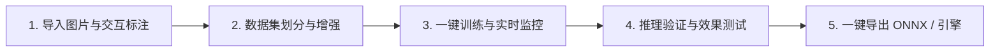

# YOLO Studio - 用户使用与操作指南 (User Manual)

**文档版本**：v1.0.0  
**适用对象**：零基础用户、AI 工程师、工业质检员、学生与科研人员

---

## 1. 软件概述与快速上手五步法

欢迎使用 **YOLO Studio 一站式图形化智能训练工作站**！本软件将繁琐的深度学习代码开发转化为直观流畅的图形化操作，只需 5 个步骤，即可从零构建专属的 AI 目标检测模型：

---

## 2. 详细操作步骤详解

### 第一步：导入图像与交互式标注 (Annotation Tab)

1. **新建或打开项目**：
   - 点击顶部菜单栏【文件】$\rightarrow$【打开项目/图片目录】，选择存放待识别图片的文件夹。
   - 左侧将显示该文件夹下的所有图片缩略图及标注状态（绿色表示已标注，灰色表示未标注）。

2. **添加自定义识别类别**：
   - 在右侧【类别管理器】中，点击【添加类别】按钮（例如输入 `dog`, `cat`, `person`）。
   - 软件会自动为不同类别分配美观且区分度高的颜色，您也可以双击色块自定义颜色。

3. **画框圈出目标对象**：
   - 在画布中，鼠标左键按住并拖拽，即可框选目标对象；
   - 松开鼠标后，在弹出的类别选择框中点击对应的类别名称（或按键盘数字键 `1`, `2`, `3` 快速绑定）；
   - **调整与移动**：点击已绘制的框，可以拖动四周或四角的手柄缩放框大小，也可以直接拖动框体移动位置；
   - **删除框**：选中框后按下键盘 `Delete` 键或 `Backspace` 键即可删除。

4. **使用 AI 辅助智能预标注 (黑科技)**：
   - 如果您有上百张图片需要圈选，可以点击工具栏上的【🤖 AI 辅助预标注】按钮；
   - 选择基础预训练模型（如 YOLOv8n）与置信度阈值，点击【一键预打标】；
   - 软件将全自动对所有图片进行初步圈选，您只需浏览并微调几个不准确的框，标注效率提升 10 倍！

5. **常用快捷键一览**：
   | 快捷键 | 功能说明 |
   | :--- | :--- |
   | `A` 或 `←` | 切换到上一张图片（自动保存当前标注） |
   | `D` 或 `→` | 切换到下一张图片（自动保存当前标注） |
   | `Ctrl + S` | 立即保存当前标注 |
   | `Ctrl + Z` | 撤销上一步操作（Undo） |
   | `Ctrl + Y` | 重做上一步操作（Redo） |
   | `Delete` | 删除当前选中的标注框 |
   | `滚轮滑动` | 以鼠标指针为中心平滑放大/缩小图像 |
   | `按住中键/空格` | 拖动画布平移视野 |

---

### 第二步：数据集管理与清洗 (Dataset Tab)

1. **数据集自动划分**：
   - 切换到【数据集管理】页面，软件会自动统计当前图片总数与各类别目标分布柱状图。
   - 拖动比例滑块（默认推荐：**训练集 80% / 验证集 15% / 测试集 5%**），点击【划分数据集】按钮，系统将自动生成标准 YOLO 目录结构与 `data.yaml` 文件。

2. **数据健康度一键体检**：
   - 点击【检查数据健康度】，软件会自动排查是否存在空框、越界坐标或破损图片，并提示一键修复。

3. **数据增强扩充 (可选)**：
   - 如果数据量较少，可勾选【水平翻转】、【亮度/对比度抖动】、【微小角度旋转】，点击【生成增强样本】，一键将数据集规模翻倍。

---

### 第三步：一键训练与实时监控 (Training Tab)

1. **选择模型架构**：
   - 切换到【模型训练】页面；
   - 在【模型选择】下拉框中选择您需要的版本：
     - **YOLOv8n / YOLO11n (Nano)**：超轻量，训练最快，适合手机、树莓派或实时性要求极高的场景；
     - **YOLOv8s / YOLO11s (Small)**：轻量平衡型，兼顾高精度与高帧率；
     - **YOLOv8m / YOLOv8x (Medium/XLarge)**：大模型，追求极限检测精度。

2. **配置训练参数 (超简单)**：
   - **训练轮数 (Epochs)**：推荐输入 `50` ~ `100` 轮；
   - **批次大小 (Batch Size)**：推荐设为 `16` 或 `Auto`（软件将根据显卡显存自动决定）；
   - **图像大小 (Image Size)**：默认 `640`；
   - **计算设备 (Device)**：软件会自动检测并选择您的 NVIDIA 独立显卡（如 `CUDA:0`），若无独显则自动使用 `CPU`。

3. **启动训练与实时曲线**：
   - 点击绿色的大按钮【🚀 开始训练】！
   - 训练期间，界面中央的指标大屏将**实时动态绘制**：
     - **损失下降曲线** (Box Loss, Class Loss)；
     - **平均精度均值** (mAP50, mAP50-95)；
     - **实时进度条与剩余时间预估 (ETA)**；
   - 界面绝不卡死，您可随时点击【暂停】或【终止】。

---

### 第四步：模型测试与推理验证 (Inference Tab)

1. **加载训练好的模型**：
   - 训练完成后，软件会自动载入最优权重 `best.pt`。您也可以点击【浏览】手动载入任何 `.pt` 权重文件。
2. **测试图像与视频**：
   - **单图/多图测试**：将待测试的图片直接拖入测试窗口，或者点击【选择图片】；
   - **视频与摄像头实时测试**：选择本地 MP4 视频，或者勾选【开启摄像头 (Webcam)】；
3. **动态调节参数**：
   - 拖动【置信度阈值 (Confidence)】滑块（如 0.50），画面中的检测框会**实时随滑块变动**，方便直观观察过滤效果。

---

### 第五步：模型导出与量化部署 (Export Tab)

1. **选择导出格式**：
   - 切换到【模型导出】页面；
   - 支持格式：
     - **ONNX (`.onnx`)**：通用标准格式，可用于 C++、C#、Python、Android、iOS 等各类跨平台部署；
     - **TensorRT (`.engine`)**：NVIDIA 显卡专属，推理速度可提升 3-5 倍；
     - **OpenVINO / TFLite / CoreML**：Intel CPU / 移动端 / Mac 芯片专属格式。
2. **一键导出**：
   - 勾选是否启用 FP16 半精度加速，点击【一键导出】；
   - 软件导出后会自动运行校验测试，确保模型能够正常推理输出！
